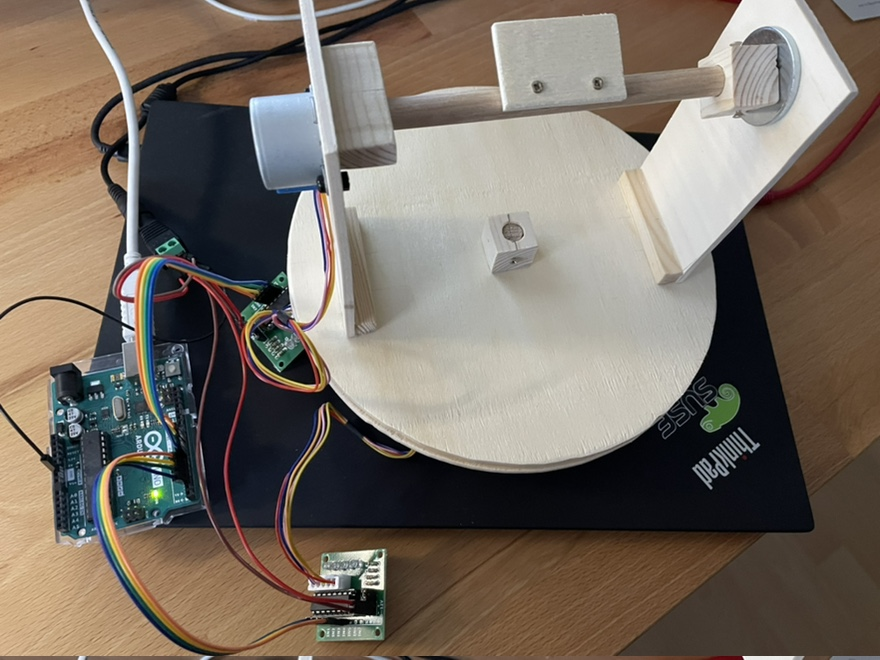
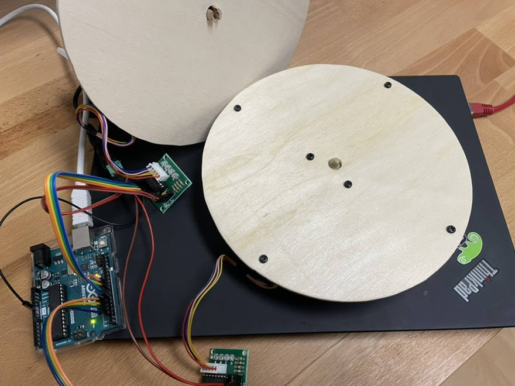

#arduino-stepper

## Original idea

Camera stand that can rotate and turn up and down to identify
and point to objects, as determined by software.

## Prototype

Handcrafted from plywood, with dense wood to connect to the motor axis.
Rotor diameter is 20cm, height is approx. 16cm.

Two 4-wire stepper motors, connect to Arduno Uno via pins 2-5 (a1-4) and
6-9 (b1-4) through ULN2003 drivers. Arduino is bus powered, motors use
external 5V power supply.

Load serial4stepper.ino into the Arduino. It should appear as /dev/ttyACM0.
Use arduino-serial.py to send commands

* l - left
* r - right
* u - up
* d- down 

or as an example for a real script.

## Next

CAD layout and 3d-printed stand with better bearings and less play, cabling
that allows 360° turns.
